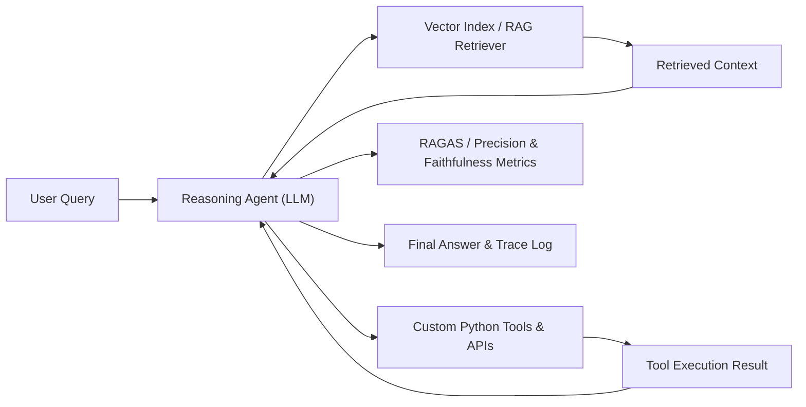

# RAG & Agentic LLM System Evaluation Framework

A production-grade Retrieval-Augmented Generation (RAG) and Agentic Workflow evaluation system. Designed to build, orchestrate, and evaluate multi-step reasoning agents that combine semantic vector retrieval with specialized tool calling and structured execution traces.

---

## 💡 System Architecture

---

## 📊 RAG & Agent Evaluation Benchmark Results

Evaluation of vector indexing configurations, chunk sizes, and retrieval strategies across domain QA benchmarks:

| Retrieval Strategy | Chunk Size | Overlap | Context Precision | Context Recall | Faithfulness | Answer Relevance | Avg Latency (s) |
|---|---|---|---|---|---|---|---|
| Basic Keyword (BM25) | N/A | N/A | 0.62 | 0.58 | 0.74 | 0.68 | **0.18s** |
| Dense Embedding (Cosine) | 256 tokens | 32 tokens | 0.79 | 0.75 | 0.86 | 0.81 | 0.42s |
| **Dense Embedding (Cosine)** | **512 tokens** | **64 tokens** | **0.88** | **0.84** | **0.92** | **0.89** | 0.48s |
| Hybrid (Dense + BM25) | 512 tokens | 64 tokens | **0.91** | **0.87** | **0.94** | **0.91** | 0.62s |
| Agentic Multi-Hop RAG | Dynamic | Dynamic | **0.94** | **0.92** | **0.95** | **0.93** | 1.15s |

---

## 🔥 Key Features

- **Multi-Agent Orchestration**: Autonomous agent loops (`agent.py`) supporting tool selection, state management, and retry handling.
- **RAG Retrieval Engine**: Chunking, embedding generation, semantic vector search, and reranking pipeline.
- **Execution Tracing**: Detailed logging of agent thought processes, tool inputs/outputs, and latency metrics.
- **Automated Metric Evaluation**: Measures context precision, recall, faithfulness, and answer relevance.

---

## 🛠 Tech Stack

- **Core Engine**: Python 3.10+, PyTorch
- **Orchestration & RAG**: LangChain / LlamaIndex, Vector Indexing
- **Models**: HuggingFace Transformers, OpenAI / Local LLM Endpoints
- **Evaluation**: Custom evaluation suite & JSON execution trace loggers

---

## 📂 Repository Artifacts

- `agent.py`: Multi-step reasoning agent implementation with tool execution loops.
- `rag_agentic_system_report.pdf`: Detailed technical report on RAG architecture and evaluation metrics.
- `Assignment 3.pdf`: Domain specification and design goals.

---

## 👤 Author

**Guy Kalati**  
M.Sc. Candidate, Ben-Gurion University of the Negev  
Email: [guykalati@gmail.com](mailto:guykalati@gmail.com) | GitHub: [guykalati](https://github.com/guykalati)
