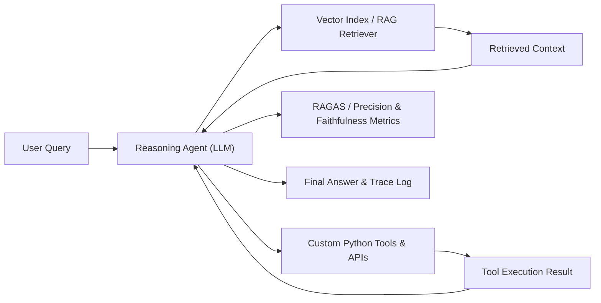

# RAG & Agentic LLM System Evaluation Framework


A production-grade Retrieval-Augmented Generation (RAG) and Agentic Workflow evaluation system. Designed to build, orchestrate, and evaluate multi-step reasoning agents that combine semantic vector retrieval with specialized tool calling and structured execution traces.

---

## 💡 System Architecture



---

## 🔥 Key Features

- **Multi-Agent Orchestration**: Autonomous agent loops (`agent.py`) supporting tool selection, state management, and retry handling.
- **RAG Retrieval Engine**: Chunking, embedding generation, semantic vector search, and reranking pipeline.
- **Execution Tracing**: Detailed logging of agent thought processes, tool inputs/outputs, and latency metrics.
- **Automated Metric Evaluation**: Measures context precision, recall, faithfulness, and answer relevance.

---

## 🛠 Tech Stack

- **Core Engine**: Python 3.10+, PyTorch
- **Orchestration & RAG**: LangChain / LlamaIndex, Vector Indexing
- **Models**: HuggingFace Transformers, OpenAI / Local LLM Endpoints
- **Evaluation**: Custom evaluation suite & JSON execution trace loggers

---

## 💻 Quick Start

```bash
# Clone and install dependencies
pip install torch transformers langchain chromadb pydantic

# Run the agent pipeline
python agent.py
```

---

## 👤 Author

**Guy Kalati**  
M.Sc. Candidate, Ben-Gurion University of the Negev  
Email: [guykalati@gmail.com](mailto:guykalati@gmail.com) | GitHub: [guykalati](https://github.com/guykalati)
